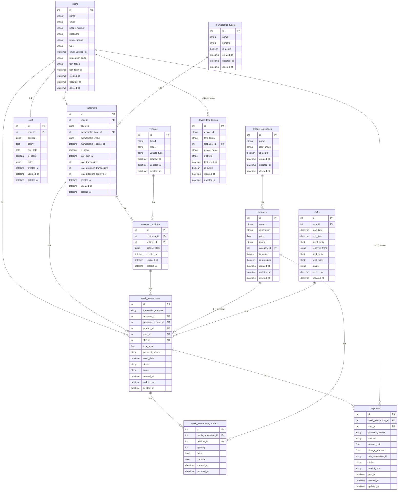

## ERD, API Endpoints, dan Alur Sistem

Dokumentasi ini memuat:

-   ERD (tabel, kolom, tipe data) beserta relasi
-   Daftar endpoint API lengkap dengan contoh payload dan response
-   Ringkasan alur sistem (auth, shift, transaksi, pembayaran, FCM)

### ERD Lengkap

Berikut ringkasan tabel, kolom, dan relasi berdasarkan seluruh migration terbaru dalam proyek ini.

-   users

    -   id: bigint PK
    -   name: varchar(255)
    -   email: varchar(255) nullable
    -   phone_number: varchar(20) nullable
    -   password: varchar(255) nullable
    -   profile_image: varchar(255) nullable
    -   type: enum('owner','admin','cashier','staff','customer')
    -   email_verified_at: timestamp nullable
    -   remember_token: varchar(100) nullable
    -   fcm_token: text nullable
    -   last_login_at: timestamp nullable
    -   created_at, updated_at: timestamp
    -   deleted_at: timestamp nullable
    -   Relasi:
        -   1-1 ke customers (users.id = customers.user_id)
        -   1-1 ke staff (users.id = staff.user_id)
        -   1-N ke wash_transactions (users.id = wash_transactions.user_id)
        -   1-N ke shifts (users.id = shifts.user_id)
        -   1-N ke payments (users.id = payments.user_id)
        -   1-N ke device_fcm_tokens (users.id = device_fcm_tokens.last_user_id)

-   membership_types

    -   id: bigint PK
    -   name: varchar(255)
    -   benefits: json nullable
    -   is_active: boolean default true
    -   created_at, updated_at: timestamp
    -   deleted_at: timestamp nullable
    -   Relasi: 1-N ke customers (membership_types.id = customers.membership_type_id)

-   customers

    -   id: bigint PK
    -   user_id: bigint FK -> users.id onDelete:cascade
    -   address: text nullable
    -   membership_type_id: bigint nullable FK -> membership_types.id onDelete:set null
    -   membership_status: enum('pending','approved','rejected') default 'pending'
    -   membership_expires_at: timestamp nullable
    -   is_active: boolean default true
    -   last_login_at: timestamp nullable
    -   total_transactions: int default 0
    -   total_premium_transactions: int default 0
    -   total_discount_approvals: int default 0
    -   created_at, updated_at: timestamp
    -   deleted_at: timestamp nullable
    -   Relasi:
        -   N-1 ke users
        -   N-1 ke membership_types
        -   1-N ke customer_vehicles
        -   1-N ke wash_transactions

-   staff

    -   id: bigint PK
    -   user_id: bigint FK -> users.id onDelete:cascade
    -   position: varchar(50) nullable
    -   salary: float nullable
    -   hire_date: date nullable
    -   is_active: boolean default true
    -   notes: text nullable
    -   created_at, updated_at: timestamp
    -   deleted_at: timestamp nullable
    -   Relasi: N-1 ke users

-   vehicles

    -   id: bigint PK
    -   brand: varchar(255) nullable
    -   model: varchar(255) nullable
    -   vehicle_type: varchar(50) nullable
    -   deleted_at: timestamp nullable
    -   created_at, updated_at: timestamp
    -   Relasi: 1-N ke customer_vehicles

-   customer_vehicles

    -   id: bigint PK
    -   customer_id: bigint FK -> customers.id onDelete:cascade
    -   vehicle_id: bigint FK -> vehicles.id onDelete:cascade
    -   license_plate: varchar(50) unique
    -   created_at, updated_at: timestamp
    -   deleted_at: timestamp nullable
    -   Relasi:
        -   N-1 ke customers
        -   N-1 ke vehicles
        -   1-N ke wash_transactions

-   product_categories

    -   id: bigint PK
    -   name: varchar(255)
    -   icon_image: varchar(255) nullable
    -   is_active: boolean default true
    -   created_at, updated_at: timestamp
    -   deleted_at: timestamp nullable
    -   Relasi: 1-N ke products

-   products

    -   id: bigint PK
    -   name: varchar(255)
    -   description: text nullable
    -   price: decimal(10,2)
    -   image: varchar(255) nullable
    -   category_id: bigint nullable FK -> product_categories.id onDelete:set null
    -   is_active: boolean default true
    -   is_premium: boolean default false
    -   created_at, updated_at: timestamp
    -   deleted_at: timestamp nullable
    -   Relasi:
        -   N-1 ke product_categories
        -   1-N ke wash_transactions (primary_product via wash_transactions.product_id)
        -   N-M ke wash_transactions via wash_transaction_products

-   shifts

    -   id: bigint PK
    -   user_id: bigint FK -> users.id onDelete:cascade
    -   start_time: datetime
    -   end_time: datetime nullable
    -   initial_cash: decimal(12,2)
    -   received_from: varchar(255)
    -   final_cash: decimal(12,2) nullable
    -   total_sales: decimal(12,2) default 0
    -   status: enum('active','closed','canceled') default 'active'
    -   created_at, updated_at: timestamp
    -   Relasi: 1-N ke wash_transactions

-   wash_transactions

    -   id: bigint PK
    -   transaction_number: varchar unique
    -   customer_id: bigint FK -> customers.id onDelete:cascade
    -   customer_vehicle_id: bigint FK -> customer_vehicles.id onDelete:cascade
    -   product_id: bigint FK -> products.id onDelete:restrict (primary)
    -   user_id: bigint FK -> users.id onDelete:restrict (petugas/kasir)
    -   shift_id: bigint nullable FK -> shifts.id onDelete:set null
    -   total_price: float(10,2) default 0
    -   payment_method: enum('cash','cashless','transfer')
    -   wash_date: datetime
    -   status: enum('pending','in_progress','completed','cancelled') default 'pending'
    -   notes: text nullable
    -   created_at, updated_at: timestamp
    -   deleted_at: timestamp nullable
    -   Relasi:
        -   N-1 ke customers, customer_vehicles, users, shifts, products
        -   N-M ke products via wash_transaction_products
        -   1-N ke payments

-   wash_transaction_products (pivot)

    -   id: bigint PK
    -   wash_transaction_id: bigint FK -> wash_transactions.id onDelete:cascade
    -   product_id: bigint FK -> products.id onDelete:restrict
    -   quantity: int default 1
    -   price: decimal(10,2)
    -   subtotal: decimal(10,2)
    -   created_at, updated_at: timestamp

-   payments

    -   id: bigint PK
    -   wash_transaction_id: bigint FK -> wash_transactions.id onDelete:cascade
    -   user_id: bigint FK -> users.id onDelete:restrict
    -   payment_number: varchar(50) unique
    -   method: enum('cash','qris')
    -   amount_paid: decimal(10,2)
    -   change_amount: decimal(10,2) default 0
    -   qris_transaction_id: varchar(100) nullable
    -   status: enum('pending','completed','failed') default 'pending'
    -   receipt_data: json nullable
    -   paid_at: timestamp nullable
    -   created_at, updated_at: timestamp

-   device_fcm_tokens

    -   id: bigint PK
    -   device_id: varchar unique
    -   fcm_token: text
    -   last_user_id: bigint nullable FK -> users.id onDelete:set null
    -   device_name: varchar nullable
    -   platform: varchar nullable
    -   last_used_at: timestamp
    -   is_active: boolean default true
    -   created_at, updated_at: timestamp

-   personal_access_tokens (Sanctum)

    -   id: bigint PK
    -   tokenable_type: varchar
    -   tokenable_id: bigint
    -   name: varchar
    -   token: varchar(64) unique
    -   abilities: text nullable
    -   last_used_at: timestamp nullable
    -   expires_at: timestamp nullable
    -   created_at, updated_at: timestamp

-   notifications (Laravel notifications)

    -   id: uuid PK
    -   type: varchar
    -   notifiable_type: varchar
    -   notifiable_id: bigint
    -   data: text
    -   read_at: timestamp nullable
    -   created_at, updated_at: timestamp

-   sessions (Laravel session)

    -   id: string PK
    -   user_id: bigint nullable index
    -   ip_address: string(45) nullable
    -   user_agent: text nullable
    -   payload: longText
    -   last_activity: int index

-   password_reset_tokens

    -   email: string PK
    -   token: string
    -   created_at: timestamp nullable

-   Spatie Permission (default names)
    -   permissions(id PK, name, guard_name, timestamps)
    -   roles(id PK, name, guard_name, timestamps, optional team FK)
    -   model_has_permissions(permission_id FK, model_type, model_id, PK composite)
    -   model_has_roles(role_id FK, model_type, model_id, PK composite)
    -   role_has_permissions(permission_id FK, role_id FK, PK composite)

#### ERD Visual (Mermaid)

Catatan: Tipe disederhanakan agar kompatibel dengan Mermaid.



### API Endpoints

Catatan umum:

-   Format sukses (kebanyakan): `{ status: "success", message: string|null, data: any }`
-   Format error (kebanyakan): `{ status: "error", message: string, data: null, details?: any }`
-   Beberapa endpoint (StaffController) mengembalikan `{ data: ... }` langsung.
-   Semua endpoint di grup protected menggunakan Sanctum (Authorization: Bearer <access_token>), kecuali `auth/register`, `auth/login`, `auth/login-with-fcm`.

#### Auth

-   POST `/api/auth/register`

    -   Body:
        ```json
        {
            "name": "John Doe",
            "email": "john@example.com",
            "password": "secret123",
            "password_confirmation": "secret123"
        }
        ```
    -   201:
        ```json
        {
            "status": "success",
            "message": "User registered successfully",
            "data": {
                "user": {
                    /* UserResource */
                },
                "access_token": "1|....",
                "refresh_token": "2|...."
            }
        }
        ```

-   POST `/api/auth/login`

    -   Body:
        ```json
        {
            "email": "john@example.com",
            "password": "secret123",
            "fcm_token": "<min 50 chars>",
            "device_id": "DEVICE-UUID",
            "device_name": "iPhone 15",
            "platform": "iOS"
        }
        ```
    -   200:
        ```json
        {
            "status": "success",
            "message": "User logged in successfully and device FCM token stored",
            "data": {
                "user": {
                    /* UserResource */
                },
                "access_token": "1|....",
                "refresh_token": "3|....",
                "fcm_token_updated": true,
                "device_token_stored": true,
                "device_id": "DEVICE-UUID"
            }
        }
        ```

-   POST `/api/auth/login-with-fcm`

    -   Body:
        ```json
        {
            "email": "john@example.com",
            "password": "secret123",
            "fcm_token": "<token>"
        }
        ```
    -   200:
        ```json
        {
            "status": "success",
            "message": "Login successful",
            "data": {
                "user": {
                    /* UserResource */
                },
                "access_token": "1|....",
                "fcm_token": "<token>",
                "message": "Login successful, FCM token updated for notifications"
            }
        }
        ```

-   GET `/api/auth/fcm-token` (auth)

    -   200:
        ```json
        {
            "status": "success",
            "message": "FCM token retrieved successfully",
            "data": {
                "fcm_token": "<token|null>",
                "has_fcm_token": true,
                "last_login_at": "..."
            }
        }
        ```

-   POST `/api/auth/logout` (auth)

    -   200:
        ```json
        {
            "status": "success",
            "message": "Logged out successfully",
            "data": null
        }
        ```

-   POST `/api/auth/device-logout` (auth)

    -   Body (opsional): `{ "device_id": "DEVICE-UUID" }`
    -   200:
        ```json
        {
            "status": "success",
            "message": "Device logged out successfully",
            "data": null
        }
        ```

-   POST `/api/auth/refresh-token` (auth)
    -   Body: `{ "refresh_token": "2|refresh_token_value" }`
    -   200: `{ "refresh_token": "5|new_refresh_token_value" }`

#### Users (auth)

-   GET `/api/users`

    -   200: `{ "status": "success", "message": "Users retrieved successfully", "data": [ /* UserResource[] */ ] }`

-   POST `/api/users`

    -   Body (contoh customer):
        ```json
        {
            "name": "Jane",
            "email": "jane@example.com",
            "phone_number": "08123",
            "password": "secret123",
            "password_confirmation": "secret123",
            "type": "customer",
            "profile_image": null,
            "address": "Jl. ...",
            "membership_type_id": 1
        }
        ```
    -   201: `{ "status": "success", "message": "User created successfully", "data": { /* UserResource */ } }`

-   GET `/api/users/{id}` → 200: UserResource wrapper

-   PUT `/api/users/{id}` → 200: UserResource wrapper

-   DELETE `/api/users/{id}` → 204 success

-   GET `/api/users/profile` → 200: UserResource wrapper

-   PUT `/api/users/profile` → 200: UserResource wrapper

-   PUT `/api/users/password` → 200 success

-   PATCH `/api/users/{id}/fcm-token` → 200 success

-   GET `/api/users/phone/{phoneNumber}` → 200 success

#### Membership Types (auth)

-   GET `/api/memberships` → 200 array
-   POST `/api/memberships` → 201
-   GET `/api/memberships/{id}` → 200
-   PUT `/api/memberships/{id}` → 200
-   DELETE `/api/memberships/{id}` → 204
-   POST `/api/memberships/{id}/restore` → 200

Catatan: Controller memvalidasi `price` dan `duration_days`, namun kolom tersebut tidak ada di DB saat ini. Field yang tersimpan konsisten dengan kolom tabel (name, benefits, is_active).

#### Product Categories (auth)

-   GET `/api/product-categories`
-   POST `/api/product-categories` (Form-Data: name, image?)
-   GET `/api/product-categories/{id}`
-   PUT `/api/product-categories/{id}` (Form-Data: name, image?)
-   DELETE `/api/product-categories/{id}`
-   POST `/api/product-categories/{id}/restore`

#### Products (auth)

-   GET `/api/products`
-   POST `/api/products` (Form-Data: name, price, image?, category_id?, is_active)
-   GET `/api/products/{id}`
-   PUT `/api/products/{id}` (Form-Data: name?, description?, price?, image?, category_id?, is_active)
-   DELETE `/api/products/{id}`
-   POST `/api/products/{id}/restore`

#### Staff (auth)

-   GET `/api/staff` → `{ "data": [...] }`
-   POST `/api/staff`
-   GET `/api/staff/{id}`
-   PUT `/api/staff/{id}`
-   DELETE `/api/staff/{id}` → 204
-   POST `/api/staff/{id}/restore` (route ada; action belum di controller)

#### Vehicles (auth)

-   GET `/api/vehicles`
-   POST `/api/vehicles`
-   GET `/api/vehicles/{id}`
-   PUT `/api/vehicles/{id}` (validator memuat `license_plate` dan `color` yang tidak ada di tabel `vehicles`)
-   DELETE `/api/vehicles/{id}`

#### Customer Vehicles (auth)

-   GET `/api/customer-vehicles` (filter `?customer_id=` atau `?vehicle_id=`)
-   GET `/api/customer-vehicles/customer/{customerId}`
-   GET `/api/customer-vehicles/vehicle/{vehicleId}`
-   GET `/api/customer-vehicles/license-plate/{licensePlate}`
-   POST `/api/customer-vehicles`
-   GET `/api/customer-vehicles/{id}`
-   PUT `/api/customer-vehicles/{id}`
-   DELETE `/api/customer-vehicles/{id}`
-   POST `/api/customer-vehicles/{id}/restore` (route ada; action belum di controller)

Behavior khusus: Jika `license_plate` duplikat saat create, API mengembalikan 201 dengan entitas existing (alih-alih 422).

#### Wash Transactions (auth)

-   GET `/api/transactions` (filter `?shift_id=`)
-   GET `/api/transactions/customer/{customerId}`
-   POST `/api/transactions`
-   GET `/api/transactions/{id}`
-   PUT `/api/transactions/{id}` (bisa replace daftar products)
-   POST `/api/transactions/{id}/complete`
-   POST `/api/transactions/{id}/cancel`
-   DELETE `/api/transactions/{id}`
-   POST `/api/transactions/{id}/restore` (route ada; action belum di controller)
-   GET `/api/trx-next-number`
-   GET `/api/trx-prev-number`

Contoh create body:

```json
{
    "customer_id": 1,
    "customer_vehicle_id": 10,
    "product_id": 5,
    "user_id": 2,
    "payment_method": "cash",
    "wash_date": "2025-07-01 10:00:00",
    "products": [
        { "product_id": 5, "quantity": 1 },
        { "product_id": 7, "quantity": 2 }
    ],
    "notes": "optional"
}
```

#### Shifts (auth)

-   POST `/api/shifts/start`
-   POST `/api/shifts/end`
-   GET `/api/shifts/current`
-   GET `/api/shifts/status`
-   GET `/api/shifts/history`
-   GET `/api/shifts/{id}`
-   GET `/api/shifts/{id}/transactions`

Contoh start body:

```json
{ "initial_cash": 500000, "received_from": "Owner" }
```

Contoh end body:

```json
{ "physical_cash": 1200000 }
```

#### FCM Token Management (auth)

-   PATCH `/api/fcm/token` (Body: `{ "fcm_token": "..." }`)
-   DELETE `/api/fcm/token`

#### FCM Notifications (auth)

-   POST `/api/fcm/send`
-   POST `/api/fcm/send-multiple`
-   GET `/api/fcm/test`
-   GET `/api/fcm/config`

Contoh send body:

```json
{
    "token": "<fcm>",
    "title": "Title",
    "body": "Body",
    "data": { "key": "value" }
}
```

#### Payment (auth)

-   POST `/api/payment/send-transaction-data`
-   GET `/api/payment/ongoing-transaction-data` (opsional `wash_transaction_id`)

Contoh send body:

```json
{
    "total_amount": 125000,
    "payment_method": "cash",
    "wash_transaction_id": 12,
    "amount_paid": 150000,
    "customer_id": 3,
    "notes": "optional"
}
```

### Alur Sistem

-   Autentikasi & Otorisasi

    -   Registrasi default `type = customer`, otomatis membuat entri `customers`.
    -   Login menghasilkan `access_token` dan (pada endpoint utama) `refresh_token`; menyimpan `fcm_token` user dan juga per-perangkat di `device_fcm_tokens` berdasarkan `device_id`.
    -   Logout perangkat menonaktifkan token FCM perangkat terkait dan mencabut bearer token saat itu.
    -   Role/permission (Spatie) disinkronkan otomatis saat `user.type` berubah.

-   Data Master

    -   Produk dan kategori CRUD; `is_premium` dipakai menghitung benefit pelanggan.
    -   Plat nomor disimpan di `customer_vehicles` (bukan `vehicles`).

-   Membership & Metrik Pelanggan

    -   `customers` memuat status membership dan metrik transaksi; metrik diupdate otomatis saat transaksi dibuat/diubah/dihapus/restore.

-   Shift Kasir

    -   `start` membuka shift dengan `initial_cash` dan memastikan satu shift aktif per user.
    -   Transaksi baru otomatis terkait `shift_id` aktif user bila ada.
    -   `end` menghitung `total_sales`, `expected_cash`, dan `difference` terhadap `physical_cash`.

-   Transaksi Cuci

    -   Nomor transaksi harian: `TRX-YYYYMMDD-SEQ` (sequence harian).
    -   Items transaksi disimpan di pivot `wash_transaction_products` (qty, price, subtotal); `total_price` hasil penjumlahan items.
    -   Status: pending → in_progress → completed/cancelled (dengan validasi state).

-   Pembayaran

    -   `/payment/send-transaction-data` memutakhirkan transaksi ke `in_progress`, menyimpan `total_amount` dan `payment_method` untuk diproses kasir.
    -   `/payment/ongoing-transaction-data` mengembalikan transaksi completed terakhir beserta pembayaran terbaru dan flag `is_print_receipt`.

-   Notifikasi FCM
    -   Mendukung single/multiple tokens; payload dapat menyertakan `data` kustom.

### Catatan Inkonsistensi & Rekomendasi

-   Beberapa route `restore` ada di routes namun action belum di controller (Staff, CustomerVehicle, WashTransaction) → tambahkan method `restore`.
-   `VehicleController::update` memvalidasi `license_plate` dan `color` yang tidak ada di tabel `vehicles` → sesuaikan validasi atau pindahkan ke `customer_vehicles`.
-   `MembershipTypeController` memvalidasi `price` dan `duration_days` yang tidak ada di tabel `membership_types` → hapus dari validasi atau tambahkan kolom bila diperlukan.
-   Metode pembayaran di `payments.method` belum mencakup `transfer`/`e_wallet` yang dipakai di logika ringkasan shift → pertimbangkan menambah enum.

—
Dokumen ini dibuat otomatis dari source code controller, model, dan migration pada saat penulisan.
